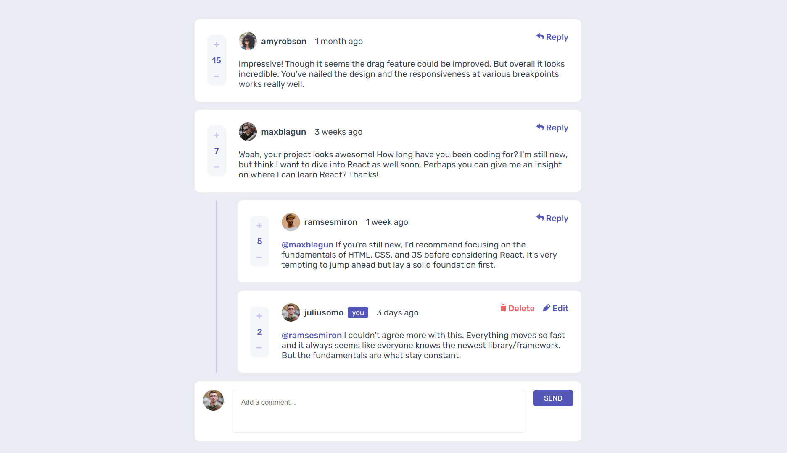
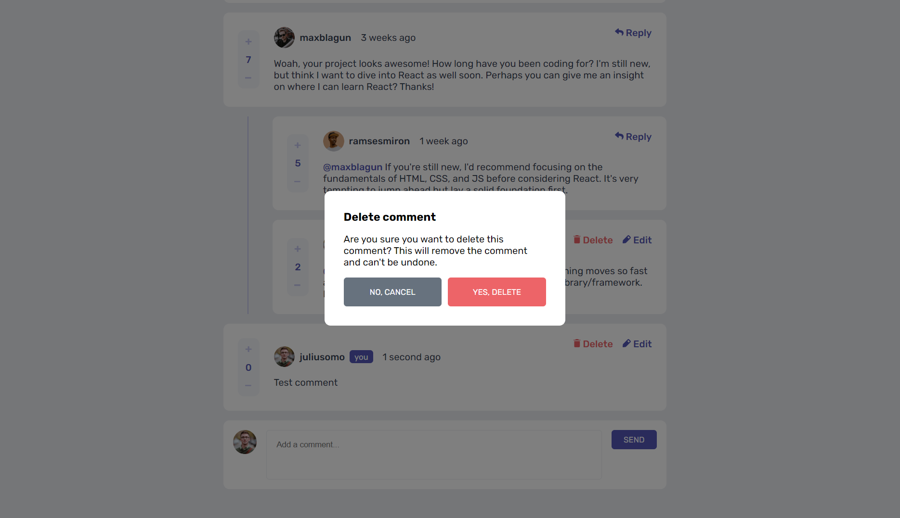
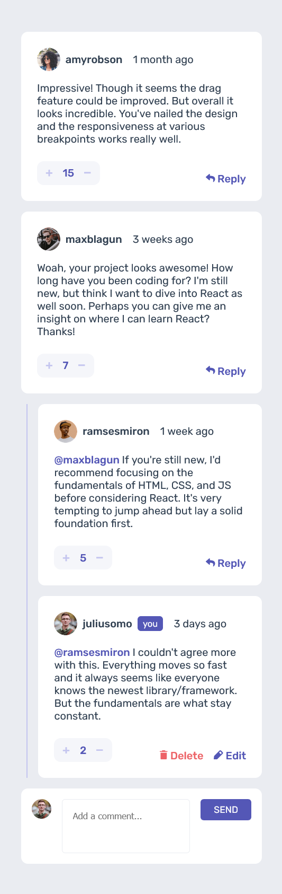
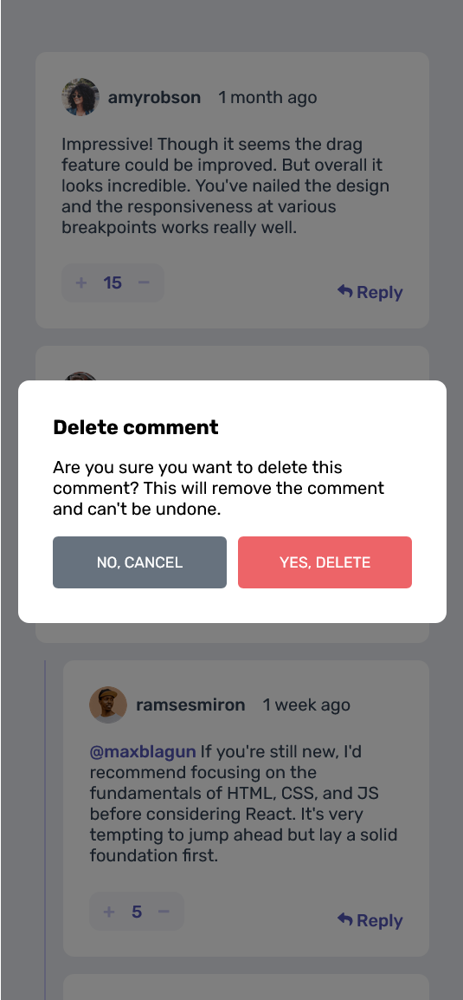

# Frontend Mentor - Interactive comments section solution

This is a solution to the [Interactive comments section challenge on Frontend Mentor](https://www.frontendmentor.io/challenges/interactive-comments-section-iG1RugEG9).

## Table of contents

- [Overview](#overview)
  - [The challenge](#the-challenge)
  - [Screenshot](#screenshot)
  - [Links](#links)

## Overview

### The challenge

Users should be able to:

- View the optimal layout for the app depending on their device's screen size
- See hover states for all interactive elements on the page
- Create, Read, Update, and Delete comments and replies
- Upvote and downvote comments
- Persist comments and replies in json-server
- Time added is automatically generated

### Screenshot

Desktop Design

Desktop Modal

Mobile Design

Mobile Modal

### Links

- Solution URL: [GitHub](https://github.com/xuanhung1509/interactive-comment-section)
- Live Site URL: [Vercel](https://comment-section-1509.vercel.app) [Netlify](https://comment-section-1509.netlify.app/)
